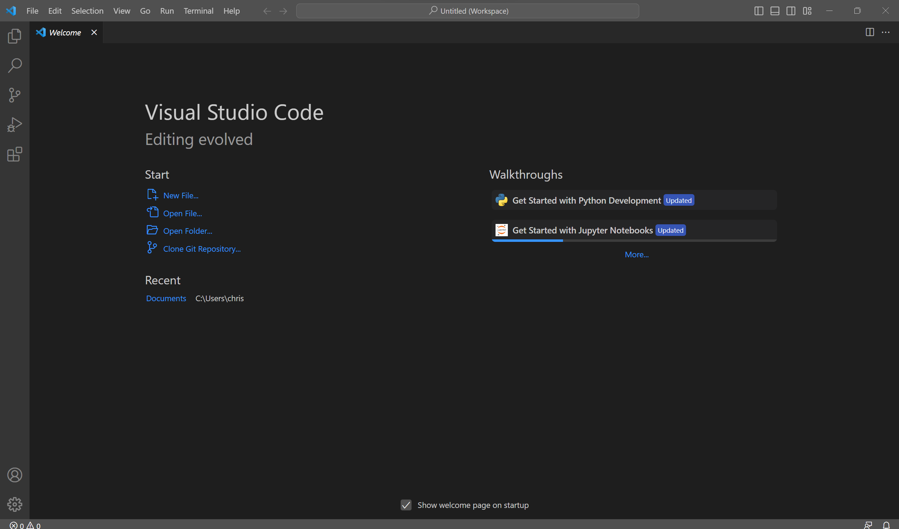
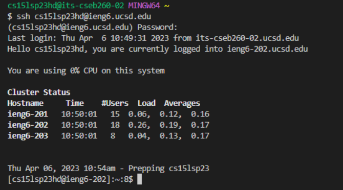
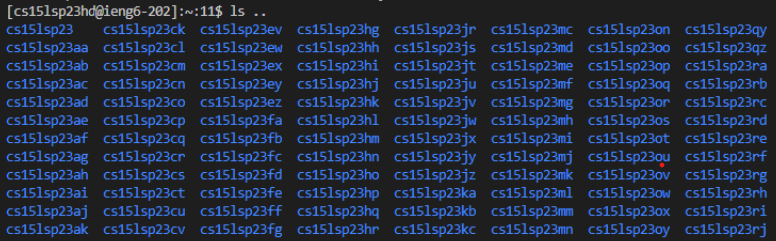

# Lab Report 1 - Remote Access and FileSystem

## 1. Installing VScode
- [Download](https://code.visualstudio.com/)  VScode
- Install VScode, don't change any default options.
- The program looks like this (For windows).

## 2. Remotely Connecting

## 3. Trying some commands

