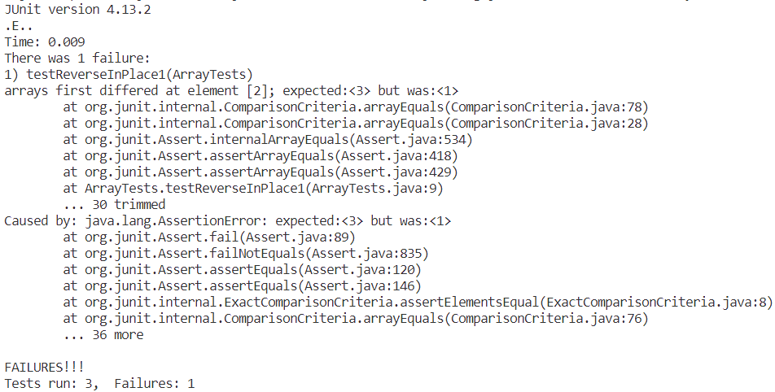

# Lab Report 2: Servers and bugs

## Part 1: StringServer

Code:

.png)

.png)

* It calls the handleRequest method. 
* url is an object with string field: "localhost:2004/add-messages?s=hello". The string field Result was "How are you" before calling this method.
* "\n hello" is added to Result after calling this method.


.png)

* It calls the handleRequest method. 
* url is an object with string field: "localhost:2004/add-messages?s=???". The string field Result was "How are you \n hello" before calling this method.
* "\n ???" is added to Result after calling this method.


## Part 2: Bugs

A failure-inducing input: 

```
@Test 
public void testReverseInPlace1() {
    int[] input1 = {3, 2, 1};
    ArrayExamples.reverseInPlace(input1);
    assertArrayEquals(new int[]{1, 2, 3}, input1);
}
```

An input that doesn’t induce a failure: 

```
@Test
public void testReverseInPlace2() {
    int[] input1 = {1};
    ArrayExamples.reverseInPlace(input1);
    assertArrayEquals(new int[]{1}, input1);
}
```

Symptom: 



The bug:

```
static void reverseInPlace(int[] arr) {
    for(int i = 0; i < arr.length; i += 1) {
      arr[i] = arr[arr.length - i - 1];
    }
}
```

The fixed code: 

```
static void reverseInPlace(int[] arr) {
    for(int i = 0; i < arr.length/2; i += 1) {
        int n = arr[i];
        arr[i] = arr[arr.length - i - 1];
        arr[arr.length - i - 1] = n;
    }
}
```


## Part 3
I learn how to use JUnit to test my methods. I gain some experiences of debugging and analyzing code. Also, by debugging the methods related to array, list and linked list methods, now I have better understanding of these data structures.
